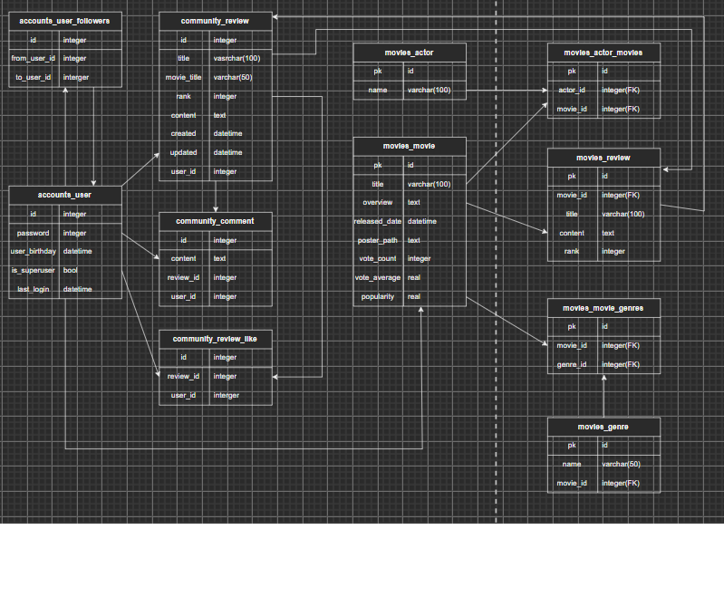
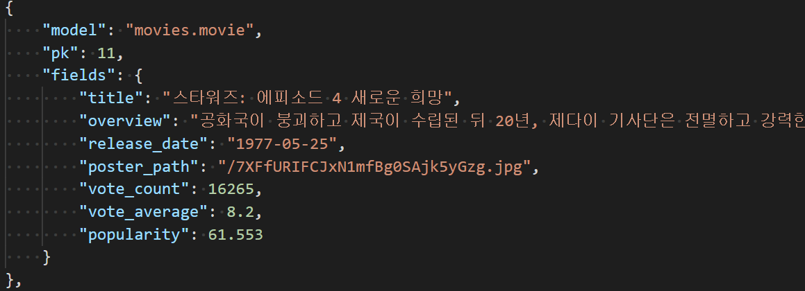

> 날짜별 정리

# 11.16

- 기본 설정들 allauth, cors, jwt 적용   

---

---


# 11.17 (첫 날)

### [MCDJ 로고](https://www.wix.com/logo/maker/esh/zoe-templates?companyName=mcdj&industry=%7B%22industry%22%3A%22dd%22%2C%22isCustom%22%3Atrue%7D&tags=dynamic%2Cfun%2Ccreative&logoPurpose=website&tid=3ba5f5c3-f513-482c-80fe-7f9a2bb19d96&referralAdditionalInfo=arenaSplitPage) & [favicon 제작](https://realfavicongenerator.net/)   


- 


### 강아지 움짤 제작   

- 


### 배경 디스코드 채팅색 적용   

- colorcop 이용 (#36393f)


### 로그인, 로그아웃, 회원가입 적용

- google로그인 새창띄움했지만, 오류가 있음 -> 뷰의 부트스트랩을 다운... 
- bootstrap모달 적용했지만  
- 모달의 우상단 종료버튼의 표시가 무척이나 마음에 들지 않아 변경하고자 했으나 찾지못함...
- 아마 뷰의 부트스트랩 설정이 완벽하지 않은 문제이지 싶음 -> 직접 만들계획(설정을 변경하는게 쉽지 않아)


### ERD 모델링 하기

- 메인으로 생각하는 유저의 생일과 영화의 RELEASED_DATE 부분의 연결에 고민시간이 더 필요



### 메인화면, 디테일 페이지 디자인

- [오븐앱](https://ovenapp.io/project/eEgZ5ttZEIHDDRNGGpS5BmVg7jG6fLzF#BXMku) 을 이용한 간단한 페이지 디자인 제작
- 넷플릭스, 왓챠, 웨이브 등의 경쟁사 벤치마킹
- 와챠와 넷플릭스를 보며 주제에 맞게 변경, 디자인


### django accounts/models.py 초안 작성  

- accouts/models.py

```
from django.db import models
from django.contrib.auth.models import AbstractUser
from django.conf import settings
# Create your models here.
class User(AbstractUser):
    followings = models.ManyToManyField('self', symmetrical=False, related_name='followers')

class Age(models.Model):
    user = models.OneToOneField(settings.AUTH_USER_MODEL, on_delete=models.CASCADE, related_name='age')
    age = models.PositiveIntegerField()
```

- community/models.py

```
from django.db import models
from django.conf import settings

# Create your models here.
class Review(models.Model):
    user = models.ForeignKey(settings.AUTH_USER_MODEL, on_delete=models.CASCADE, related_name='reviews')
    like_users = models.ManyToManyField(settings.AUTH_USER_MODEL, related_name='like_articles')
    title = models.CharField(max_length=100)
    content = models.TextField()
    created = models.DateTimeField(auto_now_add=True)
    updated = models.DateTimeField(auto_now=True)

    def __str__(self):
        return f"title : {self.title}"

class Comment(models.Model):
    review = models.ForeignKey(Review, on_delete=models.CASCADE, related_name='comments')
    user = models.ForeignKey(settings.AUTH_USER_MODEL, on_delete=models.CASCADE, related_name='comments')
    content = models.TextField()
    created = models.DateTimeField(auto_now_add=True)

```

- movies/models.py

```
from django.db import models

# Create your models here.
class Movie(models.Model):
    title = models.CharField(max_length=100)
    overview = models.TextField()
    released_date = models.DateField()
    poster_path = models.TextField
    vote_count = models.IntegerField()
    vote_average = models.FloatField()
    popularity = models.FloatField()

    def __str__(self):
        return f'title : {self.title}'

class Genre(models.Model):
    name = models.CharField(max_length=100)
    movies = models.ManyToManyField(Movie, related_name='genres')

class Actor(models.Model):
    name = models.CharField(max_length=100)
    movies = models.ManyToManyField(Movie, related_name='actors')
    
    def __str__(self):
        return f'name: {self.name}'

class Review(models.Model):
    movie = models.ForeignKey(Movie, on_delete=models.CASCADE, related_name='reviews')
    title = models.CharField(max_length=100)
    content = models.TextField()
    rank = models.PositiveIntegerField()

    def __str__(self):
        return f'{self.movie_id}, {self.title}'
```

### 모델을 작성하며 변경한 ERD 모델링


### 리드미 작성 및 계획 수립

- 주윤아 오늘도 수고 많았어 ㅎㅎ 아마 동유 오면 이 글을 발견하고 몹시 화가 날 수 있지만 그래도 오늘 고생했으니 나에게 주는 선물은 꿀잠이라고 할 수 있지 모델을 작성하기로 했는데 정말 쉽지 않다..
- 혼날 것 같으니 내일 할 일에 대해 적어보자면 아마 모델링 한 부분에 대한 모델을 작성하고 
- 장고 뷰부분을 작성하고 우리 최대 난관이자 프로젝트의 가장 핵심이 되는 생일관련 이슈를 해결할 것이다.
- 생일정보를 유저에 포함시키려다 보니 createsuperuser생성에도 문제가 생긴다고...


- 모델링 하면서 RANK 에서 별점을 메겨주기 위해서 추가적으로 아래와 같이 넣어주자~~!!


# 11.18 (둘쨋날)

## 오늘의 할일 - 계획

- 영화데이터에서 serializer 사용해서 데이터 받아오기(pjt08, pjt02 확인)
- 
- 데이터 받아온 것 app.vue 에서 뿌려주기

장르테이블 - 장르 아이디 장르이름 

영화테이블 - 영화 아이디 영화이름 장르아이디

# design

- 메인페이지 만들기(날짜 유저한테 넣어주는거 해주세요)

---

---

# 여기서 부터 실행한 일

### 어제 models.py 수정본

- community movies 의 review 기능중 rank ★ 를 작성해주기
  - (like follow comment 커뮤니티 기능구현)

```
class Review(models.Model):
    RANKS = [
        (1, '★'),
        (2, '★★'),
        (3, '★★★'),
        (4, '★★★★'),
        (5, '★★★★★'),
    ]
    user = models.ForeignKey(settings.AUTH_USER_MODEL, on_delete=models.CASCADE, related_name='reviews')
    like_users = models.ManyToManyField(settings.AUTH_USER_MODEL, related_name='like_articles')
    title = models.CharField(max_length=100)
    content = models.TextField()
    created = models.DateTimeField(auto_now_add=True)
    updated = models.DateTimeField(auto_now=True)

    def __str__(self):
        return f"title : {self.title}"
```

- 위와 같이 변경하던 중 발견한 movies 의 models.py 에서 rank는 무의미함을 발견하고 수정

# serializer작성 (accounts)

```
from rest_framework import serializers
from django.contrib.auth import get_user_model

from accounts.views import follow
from .models import Age


class UserSerializer(serializers.ModelSerializer):
    password = serializers.CharField(write_only=True)

    class Meta:
        model = get_user_model()
        fields = ('username', 'password')

class AgeSerializer(serializers.ModelSerializer):
    class human(serializers.ModelSerializer):
        class Meta:
            model = get_user_model()
            fields = ('id',)

    user = human(write_only=True)

    class Meta:
        model = Age
        fields = ('id', 'user', 'age',)


```

# serializer 작성 (community)

```
from rest_framework import serializers
from .models import Review, Comment

class ReviewSerializer(serializers.ModelSerializer):

    class Meta:
        model = Review
        fields = ('user', 'like_users', 'title', 'content', 'created', 'updated', 'rank',)

class CommentSerializer(serializers.ModelSerializer):
    class review_id(serializers.ModelSerializer):
        class Meta:
            model = Review
            fields = ('id',)
    review = review_id(write_only=True)
    class Meta:
        model = Comment
        fields = ('review', 'user', 'content', 'created')
```

# serializer 작성 (movies)

```py
class MovieSerializer(serializers.ModelSerializer):

    actor_ids = serializers.ListField(write_only=True)
    genre_ids = serializers.ListField(write_only=True)
    id = serializers.IntegerField()

    def create(self, validated_data):
        genre_ids = validated_data.pop('genre_ids')
        actor_ids = validated_data.pop('actor_ids')
        movie = Movie.objects.create(**validated_data)
        for genre_pk in genre_ids:
            movie.genres.add(genre_pk)
        for actor_pk in actor_ids:
            movie.actors.add(actor_pk)
        return movie

    class Meta:
        model = Movie
        fields = ('id', 'title', 'overview', 'release_date', 'poster_path', 'vote_count', 'vote_count', 'vote_average', 'popularity', 'genre_ids', 'actor_ids')
```

(다른 serializer는 평범하게 생겼음)   
movie를 저장할때, N:M관계여서 영화하나에 배우랑 장르가 여러개가 들어간다.   
따라서, 영화배우랑 장르는 id값을 리스트로 받기 위해, 리스트필드로 설정하고, 생성시, for문을 사용하여 movie_genre, movie_actor 테이블에 추가해준다.   

# 11.18 완벽한 백엔드를 위하여


- view   

/////////////////////////////////////////////////////////////////////   

진짜 어려웠던, DB에 영화들 저장, 다 저장하고 나니, db가 11메가가 넘었다.   

```py
def XXXX(request):
        get_genres = f"{TMDB_URL}/genre/movie/list?api_key={API_KEY}&language=ko-KR"
        genres_dict = requests.get(get_genres).json().get('genres')
        #장르들 조회 /장르 테이블 먼저 생성(ManyToMany필드 중에 한개는 먼저 만들고 참조관계 생성)
        for genre in genres_dict:
            if not Genre.objects.filter(pk=genre.get('id')).exists():
                serializer = GenreSerializer(data=genre)
                if serializer.is_valid():
                    serializer.save()
        page = 1
        while True:
            #인기영화 각 페이지마다 아래를 반복함
            get_popular = f"{TMDB_URL}/movie/popular?api_key={API_KEY}&language=ko-KR&page={page}"
            response = requests.get(get_popular).json()
            page = response.get('page')
            movies = response.get('results')
            #영화정보 한 페이지당 20개의 영화에 대해 반복함
            for movie in movies:
                movieId = movie.get('id')
                #영상여부확인
                get_videos = f"{TMDB_URL}/movie/{movieId}/videos?api_key={API_KEY}"
                if requests.get(get_videos).json().get('results'):
                    #영화테이블에 이미 존재하는 영화는 삭제
                    if Movie.objects.filter(pk=movieId).exists():
                        instance = Movie.objects.get(pk=movieId)
                        instance.delete()
                    #출연배우 3명 정보 요청
                    get_credit = f"{TMDB_URL}/movie/{movieId}/credits?api_key={API_KEY}&language=ko-KR"
                    casts = requests.get(get_credit).json().get('cast')[:3]
                    actor_ids = []
                    for cast in casts:
                        actorId = cast.get('id')
                        #배우테이블에 없는 배우 배우테이블에 추가
                        if not Actor.objects.filter(pk=actorId).exists():
                            serializer = ActorSerializer(data={'id': actorId, 'name': cast.get('name')})
                            if serializer.is_valid():
                                serializer.save()
                        actor_ids.append(actorId)
                    #배우id리스트 movie에 data에 추가
                    movie['actor_ids'] = actor_ids
                    serializer = MovieSerializer(data=movie)
                    if serializer.is_valid():
                        serializer.save()
            # 마지막 페이지면 반복문 종료
            if page >= response.get('total_pages'):
                break
            page += 1
        # 끝났으니 front 페이지로 이동
        return redirect('http://121.178.32.250:8080')
```


/////////////////////////////////////////////////////////////////////   

좀 어려웠던 영화 세부정보   

기본적인 영화정보에, 장르이름들, 배우 이름들(3개), 챗 내용들을 추가로 넣어서 응답해준다.   

```py
@api_view(['GET'])
@permission_classes([AllowAny])
def movie(request, movie_id):
    movie = get_object_or_404(Movie, pk=movie_id)
    serializer = MovieSerializer(movie)
    genres = []
    genre_set = movie.genres.all()
    for genre in genre_set:
        genres.append(genre.name)
    actors = []
    actor_set = movie.actors.all()
    for actor in actor_set:
        actors.append(actor.name)
    chats = []
    chat_set = movie.chats.all() 
    for chat in chat_set:
        chats.append({'created': chat.created, 'user': chat.user.username, 'content': chat.content})
    chats.sort(key=lambda x: x['created'])

    return Response({'movies': serializer.data, 'genres': genres, 'actors': actors, 'chats': chats})


@api_view(['GET'])
@permission_classes([AllowAny])
def search(request, keyword):
    movies = Movie.objects.filter(title__contains=keyword).order_by('-popularity')
    serializer = MovieListSerializer(movies, many=True)
    return Response(serializer.data)
```


/////////////////////////////////////////////////////////////////////   
각 해마다 인기순으로 정렬한 영화정보에서 poster_path 정보만 앞에서 5개 가져온 것에서 랜덤으로 1개씩 뽑아 리스트에 담아, 응답을 보내줌   
각종 ORM을 사용하여, poster정보를 골라 읽었다.
db는 저장하는 것보다 역시 읽어오는게 재밌다.   

```python
@api_view(['GET'])
@permission_classes([AllowAny])
def annually_poster(request):
    current_year = datetime.today().year
    year = current_year
    poster_paths = []
    while True:
        posters = Movie.objects.filter(release_date__startswith=year).order_by('-popularity').values('poster_path')[:5]
        if not posters:
            if year == current_year:
                continue
            break
        item = choice(posters)
        item['year'] = year
        poster_paths.append(item)
        year -= 1
    poster_paths.sort(key=lambda x: x['year'])
    return Response({'chronology_poster': poster_paths})

@api_view(['GET'])
@permission_classes([AllowAny])
def annual_movies(request, year):
    movies = Movie.objects.filter(release_date__startswith=year).order_by('-popularity')
    serializer = MovieListSerializer(movies, many=True)
    return Response(serializer.data)
```


/////////////////////////////////////////////////////////////////////   
Chat 생성, 삭제 요청   
chat을 생성할 때, user뿐만 아니라, movie 테이블과도 엮여있었다.   
user만 엮여있는 경우는 수업시간에 해봤지만, 이번 케이스는 처음이였다.   
serializer에서 movie를 추가해줄려했지만, 아래 방법이 가장 간단한거 같다.   

```py
@api_view(['POST'])
def chat(request, movie_id):
    serializer = ChatSerializer(data=request.data)
    if serializer.is_valid():
        movie = get_object_or_404(Movie, pk=movie_id)
        serializer.save(user=request.user, movie=movie)
        return Response(serializer.data)

@api_view(['delete'])
def delete(request, chat_id):
    chat = get_object_or_404(Chat, pk=chat_id)
    if request.user == chat.user:
        chat.delete()
    return Response({'message': '삭제완료'})
```


### DB에 영화 정보 약 7천여 데이터, 장르데이터 20, 영화배우 데이터 약 1만을 저장하였다.




저장을 하며 유용했던 터미널 명령어

- python -Xutf8 ./manage.py dumpdata

# 오늘의 마지막...

- views.py 를 작성하는데 review와 comment를 동일시 생각하며 짜다가 review에 속한 comment를 인지하고 방향을 바꾸는 중에 어려움이 발생하였다. 아래의 코드는 review를 작성한 것이고 

```
from django.shortcuts import get_object_or_404, get_list_or_404

from rest_framework import serializers, status
from rest_framework.response import Response
from rest_framework.decorators import api_view

from .serializers import ReviewSerializer, CommentSerializer
from .models import Review, Comment


@api_view(['GET', 'POST'])
def review_list_create(request):
    if request.method == 'GET':
        reviews = Review.objects.all()
        serializer = ReviewSerializer(reviews, many=True)
        return Response(serializers.data)
    else:
        serializer = ReviewSerializer(data=request.data)
        if serializer.is_valild(raise_exception=True):
            serializer.save(user=request.user)
            return Response(serializer.data, status=status.HTTP_201_CREATED)

@api_view(['PUT', 'DELETE'])
def review_update_delete(request, review_pk):
    review = get_object_or_404(Review, pk=review_pk)
    if request.method == 'PUT':
        serializer = ReviewSerializer(review, data=request.data)
        if serializer.is_valid(raise_exception=True):
            serializer.save()
            return Response(serializer.data)
    else:
        review.delete()
        return Response({'id': review_pk})
```

### *이것은 어려워서 내일 정신이 좀 멀쩡할때 작성하고자 미룬 comment 코드*

```
# 리뷰 항목의 comment 를 review의 것임을 확인하고 comment 달아주는 작업이 진행이 잘 안됨
@api_view(['GET', 'POST'])
def create_comment(request, review_pk):
    review = get_object_or_404(Review, pk=review_pk)

    if request.method == 'GET':
        comments = get_list_or_404(Comment, review=review_pk)
        serializer = CommentSerializer(comments, many=True)
        return Response(serializers.data)
    # else:
    #     serializer = CommentSerializer(data=request.data)
    #     if serializer.is_valild(raise_exception=True):
    #         serializer.save(user=request.user)
    #         return Response(serializer.data, status=status.HTTP_201_CREATED)
```

**오늘의 마지막 수정 - 김동유, 현재시각 04:44.**

---

# 11.19 (계획)

>  ### 데이터베이스 부분을 구축 완료한다.
>
> ### 프론트 엔드를 시작한다.
>
> ### 무한스크롤 적용 및 영화의 시대적 분류, 출연진들과 영화의 연결, 등
>
> ### 메인페이지 디자인, 유저의 생년월일 정보 입력가능 구현


---

# 11.19 (중간점검)

#### *문제의 comment  부분을 해결하고 css 구현하는 페어(동유)에 부러움이 들어 like 기능을 접어두고 vue를 잡아 시작페이지 디자인을 시작했다.*


#### 가장 난관이 되었던 부분인 dropdown 부분을 해결하고 다음과 같이 작성된 모습을 볼 수 있었다.

```
<template>
  <div class="home">
    
    <div>
      <b-form-select v-model="y_selected" :options="y_options" multiple :select-size="4"></b-form-select>
      <b-form-select v-model="m_selected" :options="m_options" multiple :select-size="4"></b-form-select>
      <b-form-select v-model="d_selected" :options="d_options" multiple :select-size="4"></b-form-select>
      <div class="mt-3"> 
        <strong v-if="y_selected">{{ y_selected[0] }}년     </strong> 
        <strong v-if="m_selected">{{ m_selected[0] }}월 </strong> 
        <strong v-if="d_selected">{{ d_selected[0] }}일 </strong>
      </div>
  </div>
  </div>
</template>

<script>
// @ is an alias to /src

export default {
  name: 'Home',
  components: {
  },

  data() {
      
      const y_options = []
      const m_options = []
      const d_options = []
      for (let y_index = 1938; y_index < 2022; y_index++) {
        y_options.push({value: y_index, text: y_index})
      }
      for (let m_index = 1; m_index < 13; m_index++) {
        m_options.push({value: m_index, text: m_index})
      }
      for (let d_index = 1; d_index < 32; d_index++) {
        d_options.push({value: d_index, text: d_index})
      }
      return {
        y_selected: [1995], // Array reference
        m_selected: [3], // Array reference
        d_selected: [26], // Array reference
        y_options,
        m_options,
        d_options
      }
    }
}
</script>
```


### 자바스크립트 언어가 익숙치 않아서 발생한 오류들

- push => append 이용
- for문 헤멤
- const, let 선언 
- list문의 출력을 string 으로 출력하는 데 어려움 겪음

