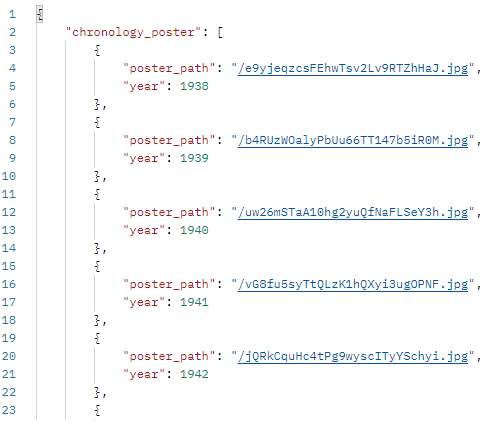

## 11.16
- 기본 설정들 allauth, cors, jwt 적용   
## 11.17
- [MCDJ 로고](https://www.wix.com/logo/maker/esh/zoe-templates?companyName=mcdj&industry=%7B%22industry%22%3A%22dd%22%2C%22isCustom%22%3Atrue%7D&tags=dynamic%2Cfun%2Ccreative&logoPurpose=website&tid=3ba5f5c3-f513-482c-80fe-7f9a2bb19d96&referralAdditionalInfo=arenaSplitPage) & [favicon 제작](https://realfavicongenerator.net/)   
- 강아지 움짤 제작   
- 배경 디스코드 채팅색 적용   
- 로그인, 로그아웃, 회원가입 적용(bootstrap모달 적용했지만, 직접 만들계획), google로그인 새창띄움했지만, 오류가 있음   
- django accounts/models.py 초안 작성   

## 11.18
- serializers   
- view   

/////////////////////////////////////////////////////////////////////
각 해마다 인기순으로 정렬한 영화정보에서 poster_path 정보만 앞에서 5개 가져온 것에서 랜덤으로 1개씩 뽑아 리스트에 담아, 응답을 보내줌
```py
@api_view(['GET'])
@permission_classes([AllowAny])
def annually_poster(request):
    current_year = datetime.today().year
    year = current_year
    poster_paths = []
    while True:
        posters = Movie.objects.filter(release_date__startswith=year).order_by('-popularity').values('poster_path')[:5]
        if not posters:
            if year == current_year:
                continue
            break
        item = choice(posters)
        item['year'] = year
        poster_paths.append(item)
        year -= 1
    poster_paths.sort(key=lambda x: x['year'])
    return Response({'chronology_poster': poster_paths})
```




- 영화 DB 저장   
```py
#utf8로 dumpdata 만들기
python -Xutf8 ./manage.py dumpdata
```