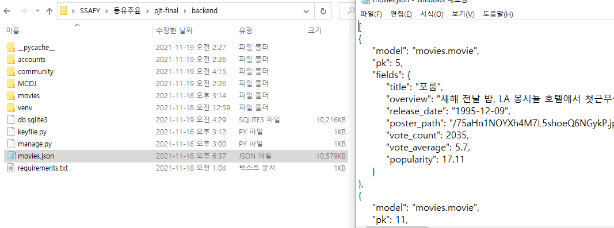
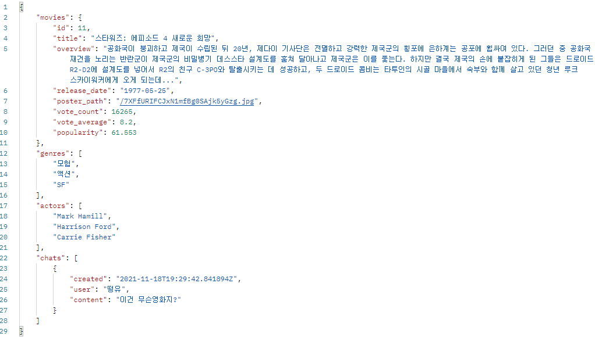
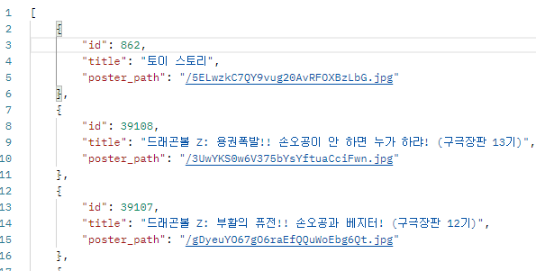
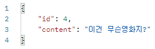

## 11.16
- 기본 설정들 allauth, cors, jwt 적용   
## 11.17 팀 로고, 방향, 모델
- [MCDJ 로고](https://www.wix.com/logo/maker/esh/zoe-templates?companyName=mcdj&industry=%7B%22industry%22%3A%22dd%22%2C%22isCustom%22%3Atrue%7D&tags=dynamic%2Cfun%2Ccreative&logoPurpose=website&tid=3ba5f5c3-f513-482c-80fe-7f9a2bb19d96&referralAdditionalInfo=arenaSplitPage) & [favicon 제작](https://realfavicongenerator.net/)   
- 강아지 움짤 제작   
- 배경 디스코드 채팅색 적용   
- 로그인, 로그아웃, 회원가입 적용(bootstrap모달 적용했지만, 직접 만들계획), google로그인 새창띄움했지만, 오류가 있음   
- django accounts/models.py 초안 작성   

## 11.18 완벽한 백엔드를 위하여
- serializers   
역시 데이터 모델링이 가장 어렵다,, 어떤 정보들을 받아서 저장할지 모델은 이미 만들어졌지만, 유효성검사를 위해 다시 점검했다.   
```py
class MovieSerializer(serializers.ModelSerializer):

    actor_ids = serializers.ListField(write_only=True)
    genre_ids = serializers.ListField(write_only=True)
    id = serializers.IntegerField()

    def create(self, validated_data):
        genre_ids = validated_data.pop('genre_ids')
        actor_ids = validated_data.pop('actor_ids')
        movie = Movie.objects.create(**validated_data)
        for genre_pk in genre_ids:
            movie.genres.add(genre_pk)
        for actor_pk in actor_ids:
            movie.actors.add(actor_pk)
        return movie

    class Meta:
        model = Movie
        fields = ('id', 'title', 'overview', 'release_date', 'poster_path', 'vote_count', 'vote_count', 'vote_average', 'popularity', 'genre_ids', 'actor_ids')
```
(다른 serializer는 평범하게 생겼음)   
movie를 저장할때, N:M관계여서 영화하나에 배우랑 장르가 여러개가 들어간다.   
따라서, 영화배우랑 장르는 id값을 리스트로 받기 위해, 리스트필드로 설정하고, 생성시, for문을 사용하여 movie_genre, movie_actor 테이블에 추가해준다.   


- view   

/////////////////////////////////////////////////////////////////////   

진짜 어려웠던, DB에 영화들 저장, 다 저장하고 나니, db가 11메가가 넘었다.   

```py
def XXXX(request):
        get_genres = f"{TMDB_URL}/genre/movie/list?api_key={API_KEY}&language=ko-KR"
        genres_dict = requests.get(get_genres).json().get('genres')
        #장르들 조회 /장르 테이블 먼저 생성(ManyToMany필드 중에 한개는 먼저 만들고 참조관계 생성)
        for genre in genres_dict:
            if not Genre.objects.filter(pk=genre.get('id')).exists():
                serializer = GenreSerializer(data=genre)
                if serializer.is_valid():
                    serializer.save()
        page = 1
        while True:
            #인기영화 각 페이지마다 아래를 반복함
            get_popular = f"{TMDB_URL}/movie/popular?api_key={API_KEY}&language=ko-KR&page={page}"
            response = requests.get(get_popular).json()
            page = response.get('page')
            movies = response.get('results')
            #영화정보 한 페이지당 20개의 영화에 대해 반복함
            for movie in movies:
                movieId = movie.get('id')
                #영상여부확인
                get_videos = f"{TMDB_URL}/movie/{movieId}/videos?api_key={API_KEY}"
                if requests.get(get_videos).json().get('results'):
                    #영화테이블에 이미 존재하는 영화는 삭제
                    if Movie.objects.filter(pk=movieId).exists():
                        instance = Movie.objects.get(pk=movieId)
                        instance.delete()
                    #출연배우 3명 정보 요청
                    get_credit = f"{TMDB_URL}/movie/{movieId}/credits?api_key={API_KEY}&language=ko-KR"
                    casts = requests.get(get_credit).json().get('cast')[:3]
                    actor_ids = []
                    for cast in casts:
                        actorId = cast.get('id')
                        #배우테이블에 없는 배우 배우테이블에 추가
                        if not Actor.objects.filter(pk=actorId).exists():
                            serializer = ActorSerializer(data={'id': actorId, 'name': cast.get('name')})
                            if serializer.is_valid():
                                serializer.save()
                        actor_ids.append(actorId)
                    #배우id리스트 movie에 data에 추가
                    movie['actor_ids'] = actor_ids
                    serializer = MovieSerializer(data=movie)
                    if serializer.is_valid():
                        serializer.save()
            # 마지막 페이지면 반복문 종료
            if page >= response.get('total_pages'):
                break
            page += 1
        # 끝났으니 front 페이지로 이동
        return redirect('http://121.178.32.250:8080')
```




/////////////////////////////////////////////////////////////////////   

좀 어려웠던 영화 세부정보   

기본적인 영화정보에, 장르이름들, 배우 이름들(3개), 챗 내용들을 추가로 넣어서 응답해준다.   

```py
@api_view(['GET'])
@permission_classes([AllowAny])
def movie(request, movie_id):
    movie = get_object_or_404(Movie, pk=movie_id)
    serializer = MovieSerializer(movie)
    genres = []
    genre_set = movie.genres.all()
    for genre in genre_set:
        genres.append(genre.name)
    actors = []
    actor_set = movie.actors.all()
    for actor in actor_set:
        actors.append(actor.name)
    chats = []
    chat_set = movie.chats.all() 
    for chat in chat_set:
        chats.append({'created': chat.created, 'user': chat.user.username, 'content': chat.content})
    chats.sort(key=lambda x: x['created'])

    return Response({'movies': serializer.data, 'genres': genres, 'actors': actors, 'chats': chats})


@api_view(['GET'])
@permission_classes([AllowAny])
def search(request, keyword):
    movies = Movie.objects.filter(title__contains=keyword).order_by('-popularity')
    serializer = MovieListSerializer(movies, many=True)
    return Response(serializer.data)
```




/////////////////////////////////////////////////////////////////////   
각 해마다 인기순으로 정렬한 영화정보에서 poster_path 정보만 앞에서 5개 가져온 것에서 랜덤으로 1개씩 뽑아 리스트에 담아, 응답을 보내줌   
각종 ORM을 사용하여, poster정보를 골라 읽었다.
db는 저장하는 것보다 역시 읽어오는게 재밌다.   

```python
@api_view(['GET'])
@permission_classes([AllowAny])
def annually_poster(request):
    current_year = datetime.today().year
    year = current_year
    poster_paths = []
    while True:
        posters = Movie.objects.filter(release_date__startswith=year).order_by('-popularity').values('poster_path')[:5]
        if not posters:
            if year == current_year:
                continue
            break
        item = choice(posters)
        item['year'] = year
        poster_paths.append(item)
        year -= 1
    poster_paths.sort(key=lambda x: x['year'])
    return Response({'chronology_poster': poster_paths})

@api_view(['GET'])
@permission_classes([AllowAny])
def annual_movies(request, year):
    movies = Movie.objects.filter(release_date__startswith=year).order_by('-popularity')
    serializer = MovieListSerializer(movies, many=True)
    return Response(serializer.data)
```




/////////////////////////////////////////////////////////////////////   
Chat 생성, 삭제 요청   
chat을 생성할 때, user뿐만 아니라, movie 테이블과도 엮여있었다.   
user만 엮여있는 경우는 수업시간에 해봤지만, 이번 케이스는 처음이였다.   
serializer에서 movie를 추가해줄려했지만, 아래 방법이 가장 간단한거 같다.   
```py
@api_view(['POST'])
def chat(request, movie_id):
    serializer = ChatSerializer(data=request.data)
    if serializer.is_valid():
        movie = get_object_or_404(Movie, pk=movie_id)
        serializer.save(user=request.user, movie=movie)
        return Response(serializer.data)

@api_view(['delete'])
def delete(request, chat_id):
    chat = get_object_or_404(Chat, pk=chat_id)
    if request.user == chat.user:
        chat.delete()
    return Response({'message': '삭제완료'})
```




- 영화 DB 저장   
TMDB popular순으로 모든 영화를 다 받아서, 배우랑 장르 관계도 추가하니 db가 11메가가 넘었다.   
fixture로 받아두기 위해, dumpdata를 시행하는데, 오류가 나서 저장이 중간에 멈췄다.   
구글링으로 검색하니, 아래와 같은 방법으로 하면 해결된다 해서 시행핬다.   
```py
#utf8로 dumpdata 만들기
python -Xutf8 ./manage.py dumpdata
```
이 방법은, 문제를 해결해줄 뿐만 아니라, utf로 변경하여 저장하여, 텍스트파일로 열어 다시 json으로 저장하는 번거로움을 덜어주기까지 한다.   


## 11.19

오늘은 frontend와 backend끼리 소통하며, 화면에 렌더링

즉, 각종 기능들 구현

infiniteScroll - 요청을 페이지마다 보내는 것이 아니기에 이전보다 훨씬 쉬움

detail 페이지, 유튭 영상 

chat model 추가

## 11.20 ~ 21
제목 키워드 검색 기능 추가

store에 유저정보, 생일정보 저장

community review 구현

community comment 구현

review 좋아요 

movie detail, community 완성(디자인까지)

## 11.22
각종 css 요소들 알아봄(네브바 등)

chronology 크로셀 요소 뜯어서, 강제로 확장시켜 페이지 조금씩 넘기게 구현

chronology 페이지 해당년도로 이동하게 구현(이동시점이 중요해서 flag변수로 만들어서 활용함)

chronology 마우스 움직임 감지해서 움직이게 구현, infinite 스크롤과 비슷하게 created일때 이벤트를 추가하고 destroyed일떄 이벤트를 제거함

## 11.23 
검색기능에 장르별 검색기능 추가

하루종일 추천알고리즘을 위해 ORM을 사용함

detail페이지 조회기록을 받기위해 Log 클래스 추가(담기 기능을 위해 Cart도 추가함)

로그인 안한 익명유저도 전부 Log에 남기기 위해 pk=0인 유저모델을 만듦

이후에, 익명유저를 처음엔 0으로 저장했지만 null로 바꿈

detail페이지 해당영화 조회기록과 chat에 남긴 별점평균을 사용하여 둘을 곱한 값을 기준으로 추천함.

일반유저는 익명유저(전체유저의 기록으로 구함)의 값과 5:3비율로 계산해서 추천

위는 일반적인 영화 우선순위임

장르를 분류해서 추천하기 위해, 영화 조회기록이 많은 장르와, 별자리를 조합해서 만듦

영화 조회기록으로 장르들의 조회수로 추천함.

생일 정보를 받아 해당 생일의 별자리의 성향을 가진 장르들은 1.25배 가중치를 줌 

그외, profile 페이지를 위한, json response를 구현함

## 11.24
오늘은 navbar와 이전에 만든 추천알고리즘을 vue에 적용할 계획

우선, 추천알고리즘 적용전에, frontend를 조금더 꾸밈

영화 검색을 할 때 불필요한 버튼들은 한곳에 모아서 offcanvas를 적용하여, 다른 페이지로 이동하는 버튼들을 숨겼다.

차별화를 두기 위함과, 영화들이 눈에 잘 들어오도록 최대한 배경들은 검은바탕의 배경을 많이 보이기 위해, 네브바 조차도 필요요소들 이외는 다 없앴다.


offpage에서, 커스터마이징을 하기 위해 carousel 요소를 뜯어서 만든것처럼 자바스크립 경로를 검색해서 강제로 크기를 변경시켜 커스터마이징했다.

화면이 줄어들었을떄 검색바가 밑으로 조금 내려가도록 window resize이벤트를 적용시켰다

carousel 을 조금더 부드럽게 움직이게하기 위해, 카드 한개씩의 움직임이 아닌 절반씩 움직이게 했다.

또, carosel밑부분의 크기를 viewpoint를 계산하여, 밑부분을 드래그로도 움직일수 있도록 만들었다. 

그외, 네브바가 추가되면서 위치를 수정해야했던, movie detail페이지의 chat위치를 수정했다.

community 보여주는 화면을 테이블화 시켰고, pagination을 직접 만들어 적용했다.

## 11.25
장르별 recommend 페이지를 만들어 profile과 연결시켰다.

모든 장르들에 대해 추천 장르순, 추천 영화순으로 보여주는 페이지를 만들어 router에 추가했다.

recommend 페이지는 오른쪽과 아래방향 모두로 끝날때까지 확대 가능하도록 만들었다.(가로세로 infinite)

profile 글씨를 잘보이게 하기 위해, 배경을 따로 적용하도록 수정하고, 애니메이션을 다시 추가했다.

home화면 생년월일 정보가 다르게 뜨는 것을 수정했다.
