# ERD 모델링 하기

M:N 관계에 겁먹어 모델링하는 것에 두려워 했으나 

작성하지 않고 있는 것보다 작성해보고 틀리면 같이 고쳐볼 든든한 페어가 있기 때문에 

다이어그램을 작성해 보았다.

가장 메인으로 생각하는 유저의 생일과 영화의 RELEASED_DATE 부분의 연결을 정확하게 표현해 내고 싶었다.

특히 구현에 맥시멀리즘을 적용해서 최대한 다 해보자는 마인드로 이전까지 했던 관계들은 모두 넣고 추가로 해보는 것을 목표로 삼았다.

ERD는 이미지가 뜨지 않고 작성한 모든것이 문자로 나와서 그림판으로 붙여넣기해줌!!

# 메인화면, 디테일 페이지 디자인


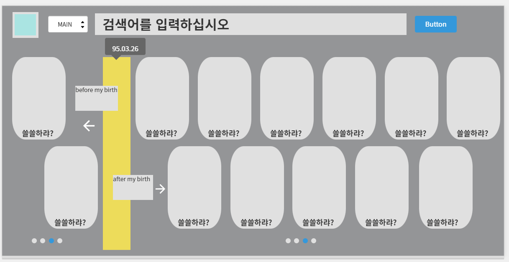

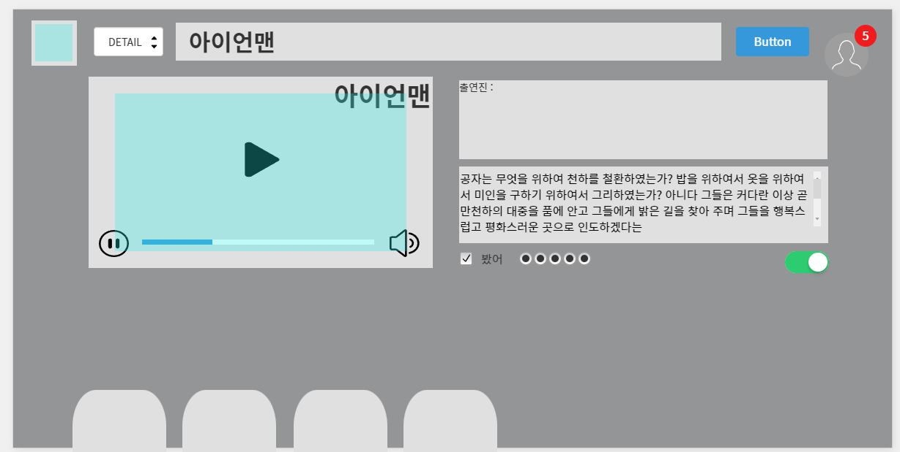

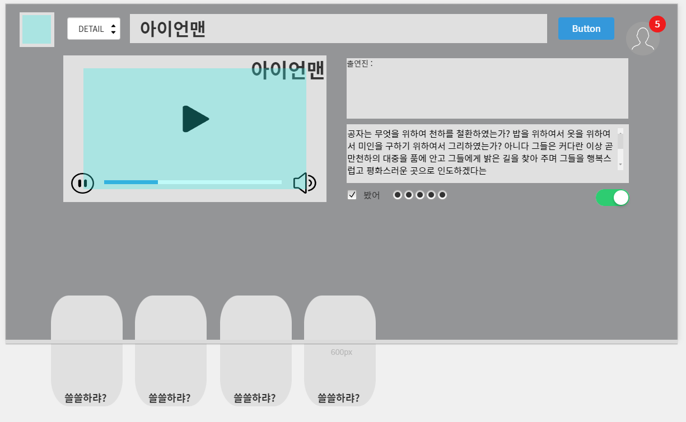

#### *스크롤 시 작성된 줄거리 내용을 더 볼수 있게 무한스크롤 기능*

#### *단 페이지는 움직임 없이 그대로 영상을 재생하도록 하고 아래의 스크롤 기능만 동적으로 기능할 수 있다.*

#### *영상 옆의 체크박스는 내가 본 영화표시*

#### *토글은 영화에 댓글을 달았거나 좋아요 한 영화에 발생한다.*


#### 페이스북의 모양의 우측 상단의 유저부분을 클릭하였을때 나타나는 코멘트창을 디자인고안한 모습

# 벤치마킹

> wavve 의 비 로그인 화면


> 넷플릭스의 초기화면

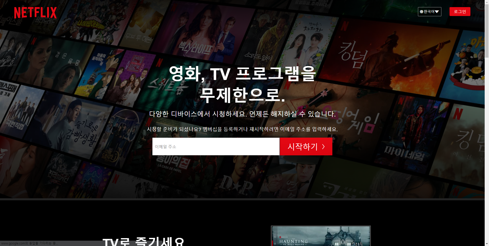

> 왓차의 초기화면

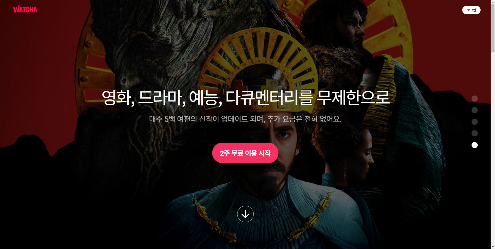

3사 모두 전체 화면을 영화로 채우고

다운스크롤링을 하지만 사용자에게 웹페이지가 원하는 버튼을 제공한다.

우리는 비로그인화면에서 제공하는 부분으로 연도 날짜를 입력받을 수 있는 칸을 넣고 추가로 로그인 할 수 있는 버튼을 넣어준다.

# 벤치마크 결과

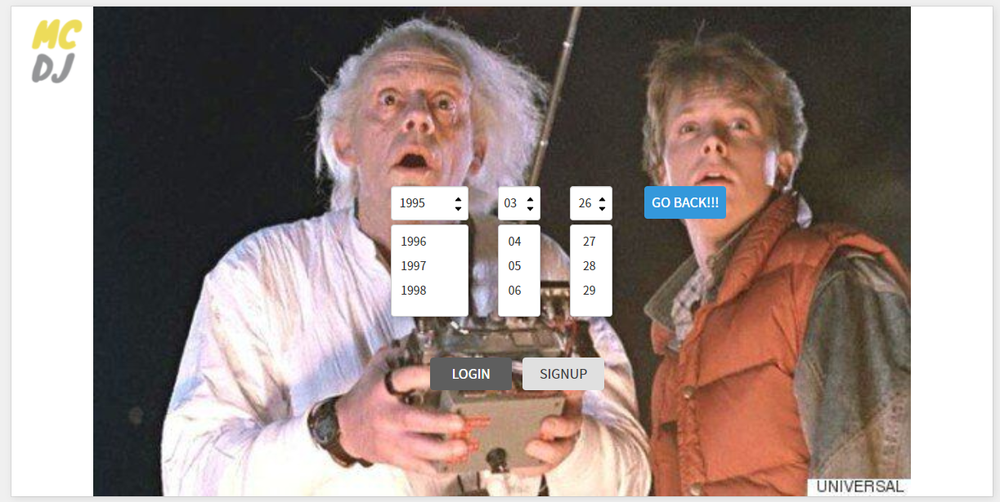

#### 우리 페이지의 특색에 맞게 BACK TO THE FUTURE 이미지를 넣어서 작성해 보았다.

#### 날짜를 드롭다운으로 선택한 뒤 버튼을 입력하면 기점으로 영화를 나누어 준다.

#### 당연히 아래에 로그인과 사인업 버튼이 존재 ㅎ


# ERD 수정 

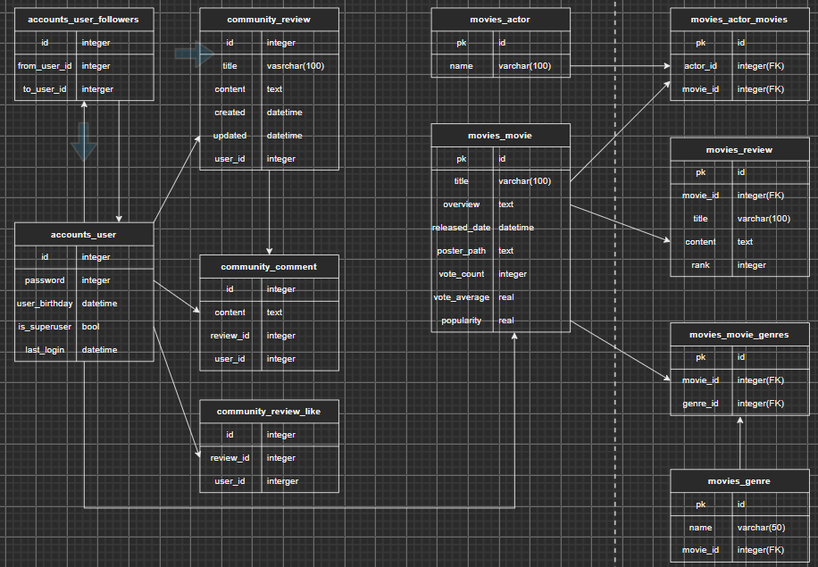

- 커뮤니티 리뷰와 영화 리뷰의 관계를 수정하였다.

### movies 앱 models 작성하기

```
from django.db import models

# Create your models here.

class genre(models.Model):
    name = models.varchar(50)


class movie(models.Model):
    title = models.CharField(max_length=100)
    overview = models.TextField()
    released_date = models.DateField()
    poster_path = models.TextField
    vote_count = models.IntegerField()
    vote_average = models.FloatField()
    popularity = models.FloatField()
    genres = models.ManyToManyField(genre, related_name='movies')

    def __str__(self):
        return f'title : {self.title}'

class actor(models.Model):
    name = models.varchar(100)
    movies = models.ManyToManyField(movie, related_name='actors')
    
    def __str__(self):
        return f'name: {self.name}'

class review(models.Model):
    movie_id = models.ForeignKey(movie, on_delete=models.CASCADE)
    title = models.varchar(100)
    content = models.TextField()
    rank = models.IntegerField()

    def __str__(self):
        return f'{self.movie_id}, {self.title}'
    


```

에 통일성과 필드명 변경을 해주었다.

```
from django.db import models

# Create your models here.
class Movie(models.Model):
    title = models.CharField(max_length=100)
    overview = models.TextField()
    released_date = models.DateField()
    poster_path = models.TextField
    vote_count = models.IntegerField()
    vote_average = models.FloatField()
    popularity = models.FloatField()

    def __str__(self):
        return f'title : {self.title}'

class Genre(models.Model):
    name = models.CharField(max_length=100)
    movies = models.ManyToManyField(Movie, related_name='genres')

class Actor(models.Model):
    name = models.CharField(max_length=100)
    movies = models.ManyToManyField(Movie, related_name='actors')
    
    def __str__(self):
        return f'name: {self.name}'

class Review(models.Model):
    movie = models.ForeignKey(Movie, on_delete=models.CASCADE, related_name='reviews')
    title = models.CharField(max_length=100)
    content = models.TextField()
    rank = models.PositiveIntegerField()

    def __str__(self):
        return f'{self.movie_id}, {self.title}'
    
```

추가로 변경해주어야 할 사항

- rank를 별점을 이욯해서 작성 가능하도록 해주자

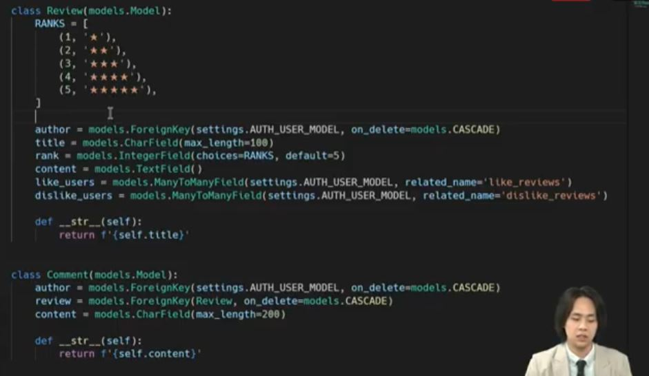

- community movies 의 review 기능중 rank ★ 를 작성해주기
  - (like follow comment 커뮤니티 기능구현)

```
class Review(models.Model):
    RANKS = [
        (1, '★'),
        (2, '★★'),
        (3, '★★★'),
        (4, '★★★★'),
        (5, '★★★★★'),
    ]
    user = models.ForeignKey(settings.AUTH_USER_MODEL, on_delete=models.CASCADE, related_name='reviews')
    like_users = models.ManyToManyField(settings.AUTH_USER_MODEL, related_name='like_articles')
    title = models.CharField(max_length=100)
    content = models.TextField()
    created = models.DateTimeField(auto_now_add=True)
    updated = models.DateTimeField(auto_now=True)

    def __str__(self):
        return f"title : {self.title}"
```

- 위와 같이 변경하던 중 발견한 movies 의 models.py 에서 rank는 무의미함을 발견하고 수정

- 보이지 않는 백엔드를 만지작 거리다가 시리얼라이저를 만나고 다시보기로 돌아갔다..


---

# serializer작성 (accounts)

```
from rest_framework import serializers
from django.contrib.auth import get_user_model

from accounts.views import follow
from .models import Age


class UserSerializer(serializers.ModelSerializer):
    password = serializers.CharField(write_only=True)

    class Meta:
        model = get_user_model()
        fields = ('username', 'password')

class AgeSerializer(serializers.ModelSerializer):
    class human(serializers.ModelSerializer):
        class Meta:
            model = get_user_model()
            fields = ('id',)

    user = human(write_only=True)

    class Meta:
        model = Age
        fields = ('id', 'user', 'age',)


```

# serializer 작성 (community)

```
from rest_framework import serializers
from .models import Review, Comment

class ReviewSerializer(serializers.ModelSerializer):

    class Meta:
        model = Review
        fields = ('user', 'like_users', 'title', 'content', 'created', 'updated', 'rank',)

class CommentSerializer(serializers.ModelSerializer):
    class review_id(serializers.ModelSerializer):
        class Meta:
            model = Review
            fields = ('id',)
    review = review_id(write_only=True)
    class Meta:
        model = Comment
        fields = ('review', 'user', 'content', 'created')
```

# 오늘의 마지막...

- views.py 를 작성하는데 review와 comment를 동일시 생각하며 짜다가 review에 속한 comment를 인지하고 방향을 바꾸는 중에 어려움이 발생하였다. 아래의 코드는 review를 작성한 것이고 

```
from django.shortcuts import get_object_or_404, get_list_or_404

from rest_framework import serializers, status
from rest_framework.response import Response
from rest_framework.decorators import api_view

from .serializers import ReviewSerializer, CommentSerializer
from .models import Review, Comment


@api_view(['GET', 'POST'])
def review_list_create(request):
    if request.method == 'GET':
        reviews = Review.objects.all()
        serializer = ReviewSerializer(reviews, many=True)
        return Response(serializers.data)
    else:
        serializer = ReviewSerializer(data=request.data)
        if serializer.is_valild(raise_exception=True):
            serializer.save(user=request.user)
            return Response(serializer.data, status=status.HTTP_201_CREATED)

@api_view(['PUT', 'DELETE'])
def review_update_delete(request, review_pk):
    review = get_object_or_404(Review, pk=review_pk)
    if request.method == 'PUT':
        serializer = ReviewSerializer(review, data=request.data)
        if serializer.is_valid(raise_exception=True):
            serializer.save()
            return Response(serializer.data)
    else:
        review.delete()
        return Response({'id': review_pk})
```

### *이것은 어려워서 내일 정신이 좀 멀쩡할때 작성하고자 미룬 comment 코드*

```
# 리뷰 항목의 comment 를 review의 것임을 확인하고 comment 달아주는 작업이 진행이 잘 안됨
@api_view(['GET', 'POST'])
def create_comment(request, review_pk):
    review = get_object_or_404(Review, pk=review_pk)

    if request.method == 'GET':
        comments = get_list_or_404(Comment, review=review_pk)
        serializer = CommentSerializer(comments, many=True)
        return Response(serializers.data)
    # else:
    #     serializer = CommentSerializer(data=request.data)
    #     if serializer.is_valild(raise_exception=True):
    #         serializer.save(user=request.user)
    #         return Response(serializer.data, status=status.HTTP_201_CREATED)
```


# 11.19 (계획)

>  ### 데이터베이스 부분을 구축 완료한다.
>
> ### 프론트 엔드를 시작한다.
>
> ### 무한스크롤 적용 및 영화의 시대적 분류, 출연진들과 영화의 연결, 등
>
> ### 메인페이지 디자인, 유저의 생년월일 정보 입력가능 구현


---

# 11.19 (중간점검)

#### *문제의 comment  부분을 해결하고 css 구현하는 페어(동유)에 부러움이 들어 like 기능을 접어두고 vue를 잡아 시작페이지 디자인을 시작했다.*

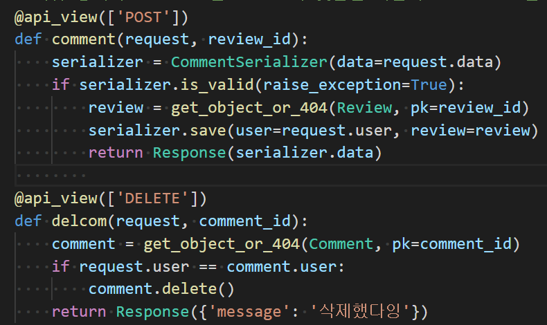

#### 가장 난관이 되었던 부분인 dropdown 부분을 해결하고 다음과 같이 작성된 모습을 볼 수 있었다.

```
<template>
  <div class="home">
    
    <div>
      <b-form-select v-model="y_selected" :options="y_options" multiple :select-size="4"></b-form-select>
      <b-form-select v-model="m_selected" :options="m_options" multiple :select-size="4"></b-form-select>
      <b-form-select v-model="d_selected" :options="d_options" multiple :select-size="4"></b-form-select>
      <div class="mt-3"> 
        <strong v-if="y_selected">{{ y_selected[0] }}년     </strong> 
        <strong v-if="m_selected">{{ m_selected[0] }}월 </strong> 
        <strong v-if="d_selected">{{ d_selected[0] }}일 </strong>
      </div>
  </div>
  </div>
</template>

<script>
// @ is an alias to /src

export default {
  name: 'Home',
  components: {
  },

  data() {
      
      const y_options = []
      const m_options = []
      const d_options = []
      for (let y_index = 1938; y_index < 2022; y_index++) {
        y_options.push({value: y_index, text: y_index})
      }
      for (let m_index = 1; m_index < 13; m_index++) {
        m_options.push({value: m_index, text: m_index})
      }
      for (let d_index = 1; d_index < 32; d_index++) {
        d_options.push({value: d_index, text: d_index})
      }
      return {
        y_selected: [1995], // Array reference
        m_selected: [3], // Array reference
        d_selected: [26], // Array reference
        y_options,
        m_options,
        d_options
      }
    }
}
</script>
```


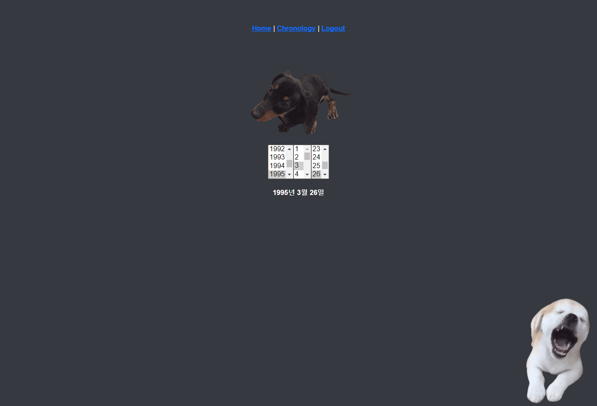

### 자바스크립트 언어가 익숙치 않아서 발생한 오류들

- push => append 이용
- for문 헤멤
- const, let 선언 
- list문의 출력을 string 으로 출력하는 데 어려움 겪음

# 11.20

오늘은 재밌는 거만 하는 날?!

동유네 집에 갔다 ㅋㅋㅋ

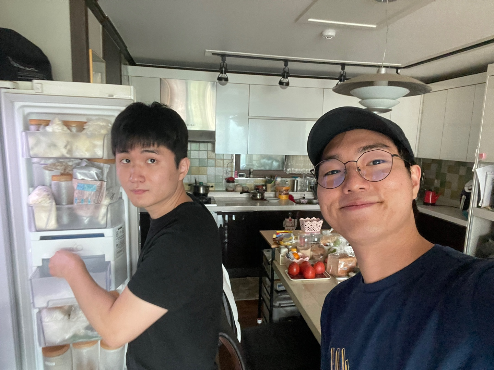

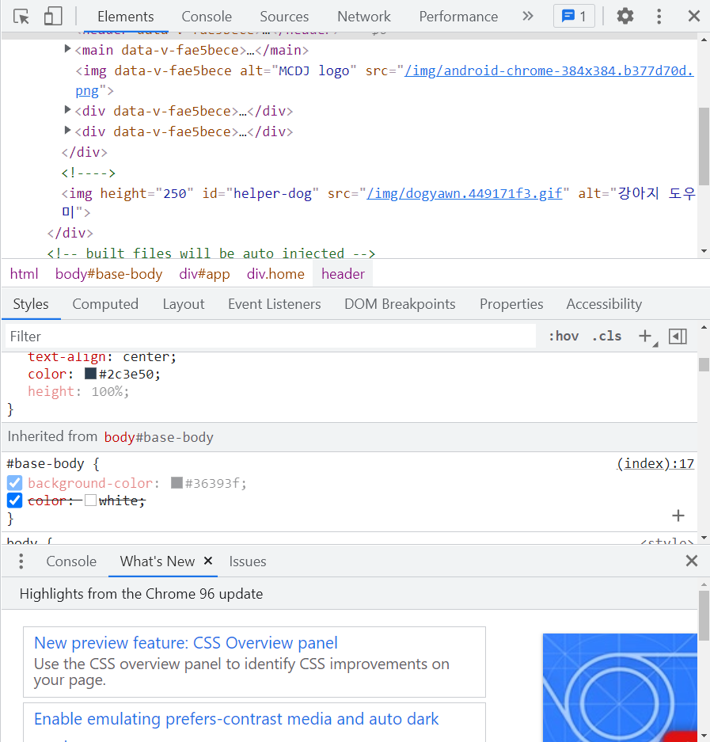

가장 우선적으로 홈페이지 화면을 변경해 보았다.

중요한 점은 내가 어제 작성한 연월일 입력창이 안보임...

배경이 뒤로 가야하는데 앞으로 나온 탓인듯...

# 11.21

동유네 가서 2일째

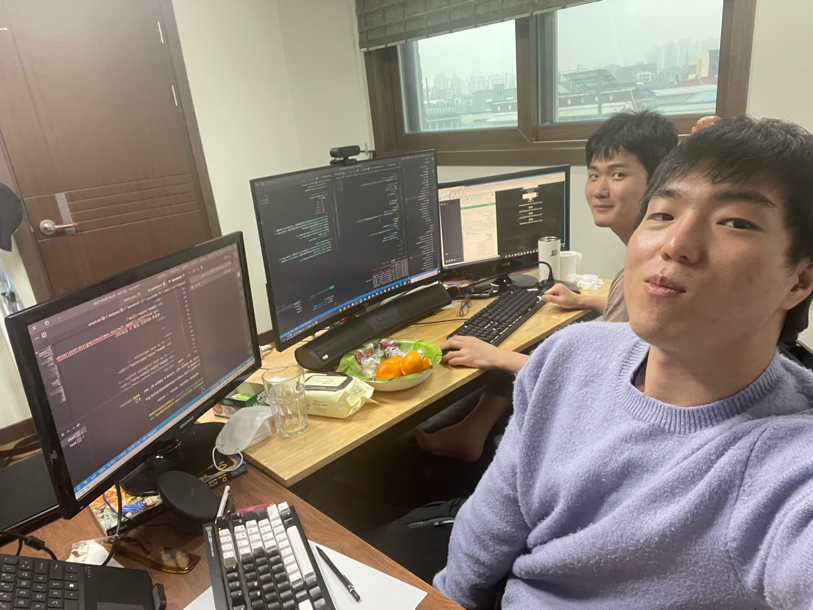

동구를 보고싶었으나 동구는 1층에서 나는 2층에서

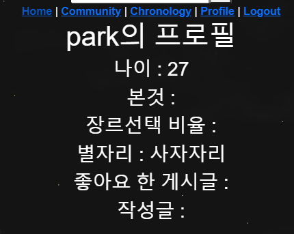

프로필 페이지를 작성했다.

store에 정보 저장, 불러오기를 사용한 나이정보 표시

경로 : src -> store -> index.js 

추가한 내용

```
import createPersistedState from "vuex-persistedstate";
```

```
const today = new Date()
const todayYear = today.getFullYear()
const todayMonth = today.getMonth() + 1
const todayDate = today.getDate()
const todayYMD = {
  year: todayYear,
  month: todayMonth,
  date: todayDate,
}
// export~
export default new Vuex.Store({
//	...
    user: {
          id: 0,
          username: '',
          birthday: {...todayYMD,},
        },
    mutations: {
    //	...
        GET_BIRTHDAY: (state, birthday) => state.user.birthday = {...birthday},
    },
    plugins: [createPersistedState()],
```

profile.vue

```
<h1>{{ $store.state.user.username }}의 프로필</h1>
<h3>나이 : {{ 2022 - $store.state.user.birthday.year }}</h3>
<h3 v-if="($store.state.user.birthday.month == 1 && $store.state.user.birthday.day >= 20) || ($store.state.user.birthday.month == 2 && $store.state.user.birthday.day <= 18) ">별자리 : 물병자리 </h3>
    
```

별자리 정보를 다른 방식으로 분류가능한 방법이 있을까???


---

# 11.22

### 발생한 문제들

- 생년월일 정보중 월 일 정보 문제가 생긴듯!!
  - [x] 별자리 정보 안나옴(day -> date 변경완료)
- 생년 입력후 이동하는 페이지와 chronology 연도 페이지 url 겹침 현상

- profile 제작중

- 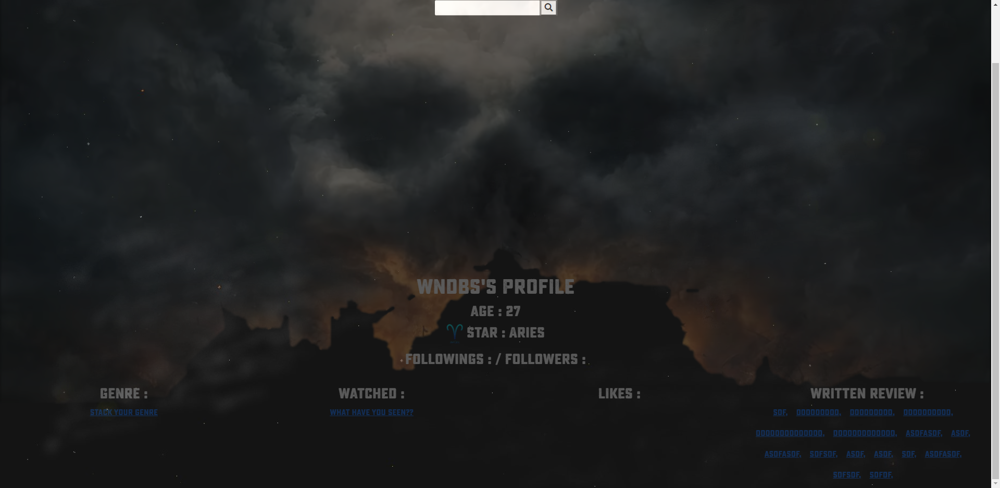

  - [ ] 배경의 크기가 relative 하나 nav바와 위치가 조절이 잘 안되어 가림현상 혹은 눌리지 않는 현상 발생 -> 임시조치 div height 줌

  - [ ] follow 기능 구현 미비
  - [x] 생일 정보를 이용해 별자리 확인 가능, 이미지 붙여주기
  - [x] watched, genre 선택전 링크를 보여주고 (a 태그 이용해 일단 만듦)
  - [ ] 링크 클릭시 각 해당 가능 url 장소로 이동
  - [x] 프로필에 해당하는 장르, 본 영화, 좋아요 누른 영화, 리뷰글 쓴 것 그룹화 하여 justifycontent 
    - 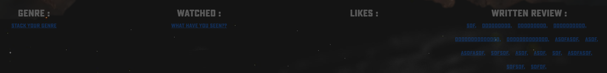

이따 일어나서 해야할 일 

- 팔로윙 기능 작성
- 태그들 이용해 이동할 url 작성해주기
- 비로그인 사용자의 경우도 부분적 profile 허용?! -> 페어와 얘기 해보기

# 11.23

### 온종일 프로필 페이지 작성

<video src="README_J.assets/녹화_2021_11_24_05_25_52_141.mp4"></video>

프로필 페이지의 반복된 작업을 통해 영화 엔딩 크레딧 화면과 같이 꾸며보고자 작성

- css animation 효과
- profile 유저의 변경해야 할 점 
  - -> $store.state.user.username -> $route.params.userId
  - components 만들면서 router(profileEmit) 이동 버튼을 변경
  - <profile-emit/> 에 bind 되지 않는 점 확인...
  - review 부분 키값 설정이 안되어서인지 나타나지 않는 점 확인

- 하게될 일
  - nav바 생성시 홈 화면 변경
  - profile 페이지 완벽히 작성하기
  - 방금 확인한 점-> profile 페이지에서 refresh 하면 돌아가는 화면이 home화면... 수정하기
  - 

# 11.24

- 프로필 페이지를 완성했다
  - 동유의 도움을 통해 django에서 받은 data를 vue에서 끌어오는 문제를 해결할 수 있었다.	
  - 라우터의 개념을 조금 더 잘 알수 있던 작업이었다.
  - 프로필 페이지를 2개를 운영하도록 만들었다. 본인의 프로필 페이지로 이동하는 손쉬운 방법을 찾게 되었다.
    - 이를 이용해 chronology페이지또한 가능하게 함
- 문제상황봉착
  - 로그인한 뒤 화면에 타임머신 입력값이 현재 날짜인 경우 비추게 하는데 예를들어 로그인후 생년월일을 변경하고 나면 홈화면으로 돌아가서 다시 입력이 가능한 상황을 만난다... 이거 어쩔 수 있나??
  - 우선 깃의 활용이 아직도 익숙치 않다. 방금전에 풀 푸쉬 하는 과정에서 signup.vue 파일의 이름이 Signup.vue 가아니라 소문자로 나와서 시간낭비가 되었다. 문제의 원인이 무엇인지 모르지만 동유도 나도 곤란스러운 상황이 마주친다.
  - 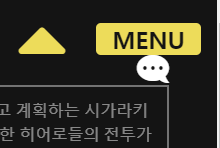
  - 네브바의 배경이 투명해서 안눌리는 것처럼 느껴지는 경우가 생김 ㅋㅋㅋ 
  - 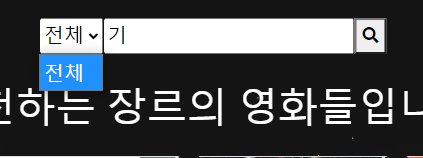
  - 풀푸쉬의 문제인가 장르 선택 드롭다운의 문제가 발생한듯...
  - 홈 화면의 액션css가 자꾸 돌아가서 타임바 누르는 것을 방해하기도 함... 바꾸는게 나을듯

