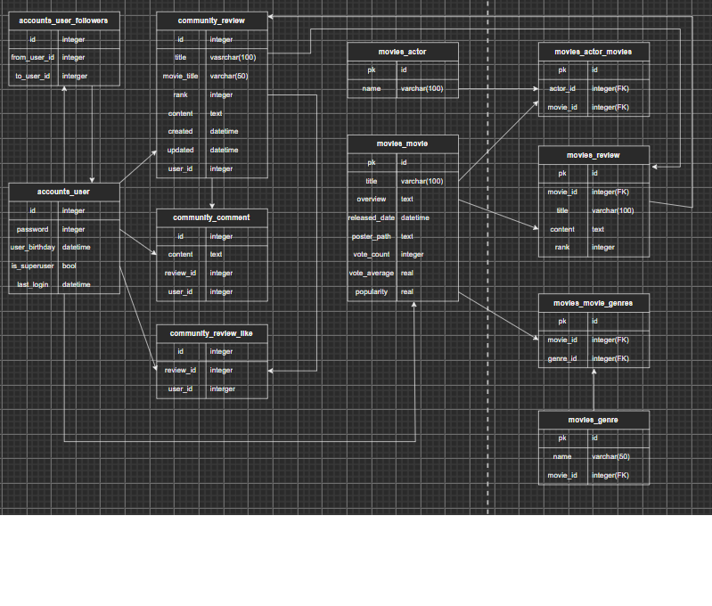
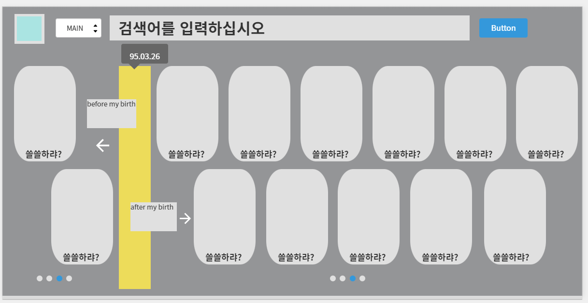
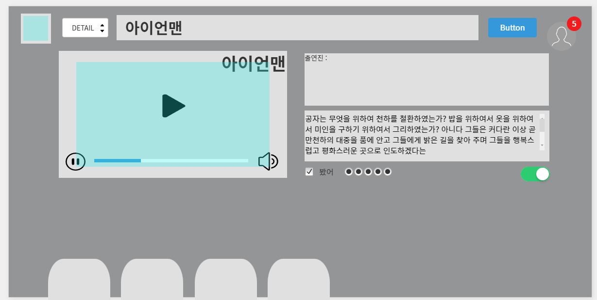
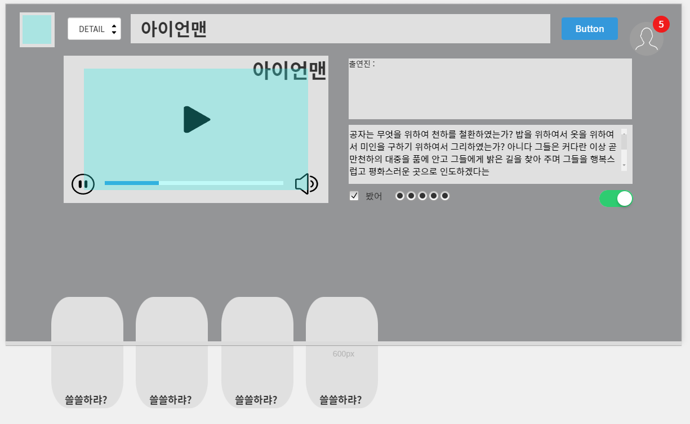
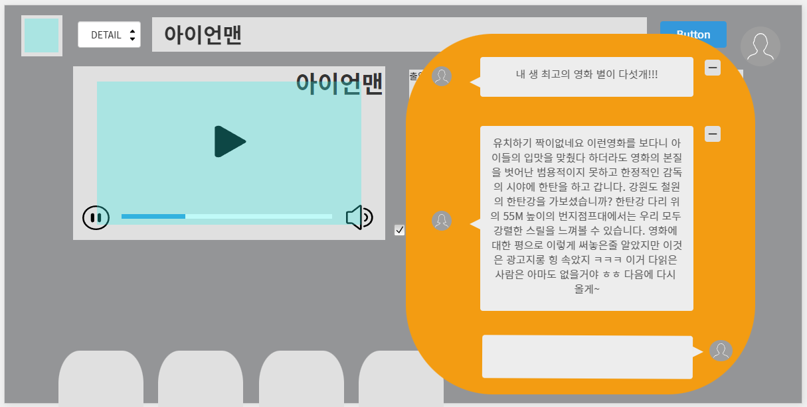

# ERD 모델링 하기

M:N 관계에 겁먹어 모델링하는 것에 두려워 했으나 

작성하지 않고 있는 것보다 작성해보고 틀리면 같이 고쳐볼 든든한 페어가 있기 때문에 

다이어그램을 작성해 보았다.

가장 메인으로 생각하는 유저의 생일과 영화의 RELEASED_DATE 부분의 연결을 정확하게 표현해 내고 싶었다.

특히 구현에 맥시멀리즘을 적용해서 최대한 다 해보자는 마인드로 이전까지 했던 관계들은 모두 넣고 추가로 해보는 것을 목표로 삼았다.

ERD는 이미지가 뜨지 않고 작성한 모든것이 문자로 나와서 그림판으로 붙여넣기해줌!!

# 메인화면, 디테일 페이지 디자인

#### *스크롤 시 작성된 줄거리 내용을 더 볼수 있게 무한스크롤 기능*

#### *단 페이지는 움직임 없이 그대로 영상을 재생하도록 하고 아래의 스크롤 기능만 동적으로 기능할 수 있다.*

#### *영상 옆의 체크박스는 내가 본 영화표시*

#### *토글은 영화에 댓글을 달았거나 좋아요 한 영화에 발생한다.*

#### 페이스북의 모양의 우측 상단의 유저부분을 클릭하였을때 나타나는 코멘트창을 디자인고안한 모습

