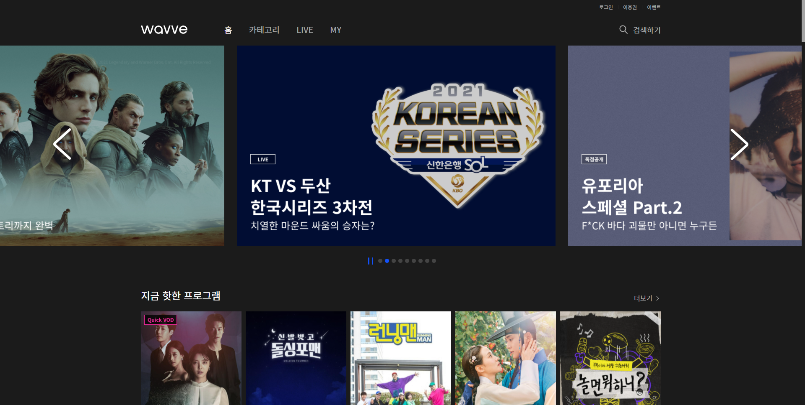

# ERD 모델링 하기

M:N 관계에 겁먹어 모델링하는 것에 두려워 했으나 

작성하지 않고 있는 것보다 작성해보고 틀리면 같이 고쳐볼 든든한 페어가 있기 때문에 

다이어그램을 작성해 보았다.

가장 메인으로 생각하는 유저의 생일과 영화의 RELEASED_DATE 부분의 연결을 정확하게 표현해 내고 싶었다.

특히 구현에 맥시멀리즘을 적용해서 최대한 다 해보자는 마인드로 이전까지 했던 관계들은 모두 넣고 추가로 해보는 것을 목표로 삼았다.

ERD는 이미지가 뜨지 않고 작성한 모든것이 문자로 나와서 그림판으로 붙여넣기해줌!!

# 메인화면, 디테일 페이지 디자인


#### *스크롤 시 작성된 줄거리 내용을 더 볼수 있게 무한스크롤 기능*

#### *단 페이지는 움직임 없이 그대로 영상을 재생하도록 하고 아래의 스크롤 기능만 동적으로 기능할 수 있다.*

#### *영상 옆의 체크박스는 내가 본 영화표시*

#### *토글은 영화에 댓글을 달았거나 좋아요 한 영화에 발생한다.*


#### 페이스북의 모양의 우측 상단의 유저부분을 클릭하였을때 나타나는 코멘트창을 디자인고안한 모습

# 벤치마킹

> wavve 의 비 로그인 화면



> 넷플릭스의 초기화면


> 왓차의 초기화면


3사 모두 전체 화면을 영화로 채우고

다운스크롤링을 하지만 사용자에게 웹페이지가 원하는 버튼을 제공한다.

우리는 비로그인화면에서 제공하는 부분으로 연도 날짜를 입력받을 수 있는 칸을 넣고 추가로 로그인 할 수 있는 버튼을 넣어준다.

# 벤치마크 결과


#### 우리 페이지의 특색에 맞게 BACK TO THE FUTURE 이미지를 넣어서 작성해 보았다.

#### 날짜를 드롭다운으로 선택한 뒤 버튼을 입력하면 기점으로 영화를 나누어 준다.

#### 당연히 아래에 로그인과 사인업 버튼이 존재 ㅎ


# ERD 수정 


- 커뮤니티 리뷰와 영화 리뷰의 관계를 수정하였다.

### movies 앱 models 작성하기

```
from django.db import models

# Create your models here.

class genre(models.Model):
    name = models.varchar(50)


class movie(models.Model):
    title = models.CharField(max_length=100)
    overview = models.TextField()
    released_date = models.DateField()
    poster_path = models.TextField
    vote_count = models.IntegerField()
    vote_average = models.FloatField()
    popularity = models.FloatField()
    genres = models.ManyToManyField(genre, related_name='movies')

    def __str__(self):
        return f'title : {self.title}'

class actor(models.Model):
    name = models.varchar(100)
    movies = models.ManyToManyField(movie, related_name='actors')
    
    def __str__(self):
        return f'name: {self.name}'

class review(models.Model):
    movie_id = models.ForeignKey(movie, on_delete=models.CASCADE)
    title = models.varchar(100)
    content = models.TextField()
    rank = models.IntegerField()

    def __str__(self):
        return f'{self.movie_id}, {self.title}'
    


```

에 통일성과 필드명 변경을 해주었다.

```
from django.db import models

# Create your models here.
class Movie(models.Model):
    title = models.CharField(max_length=100)
    overview = models.TextField()
    released_date = models.DateField()
    poster_path = models.TextField
    vote_count = models.IntegerField()
    vote_average = models.FloatField()
    popularity = models.FloatField()

    def __str__(self):
        return f'title : {self.title}'

class Genre(models.Model):
    name = models.CharField(max_length=100)
    movies = models.ManyToManyField(Movie, related_name='genres')

class Actor(models.Model):
    name = models.CharField(max_length=100)
    movies = models.ManyToManyField(Movie, related_name='actors')
    
    def __str__(self):
        return f'name: {self.name}'

class Review(models.Model):
    movie = models.ForeignKey(Movie, on_delete=models.CASCADE, related_name='reviews')
    title = models.CharField(max_length=100)
    content = models.TextField()
    rank = models.PositiveIntegerField()

    def __str__(self):
        return f'{self.movie_id}, {self.title}'
    
```

