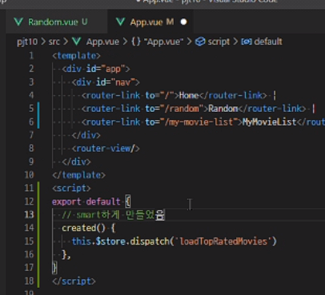
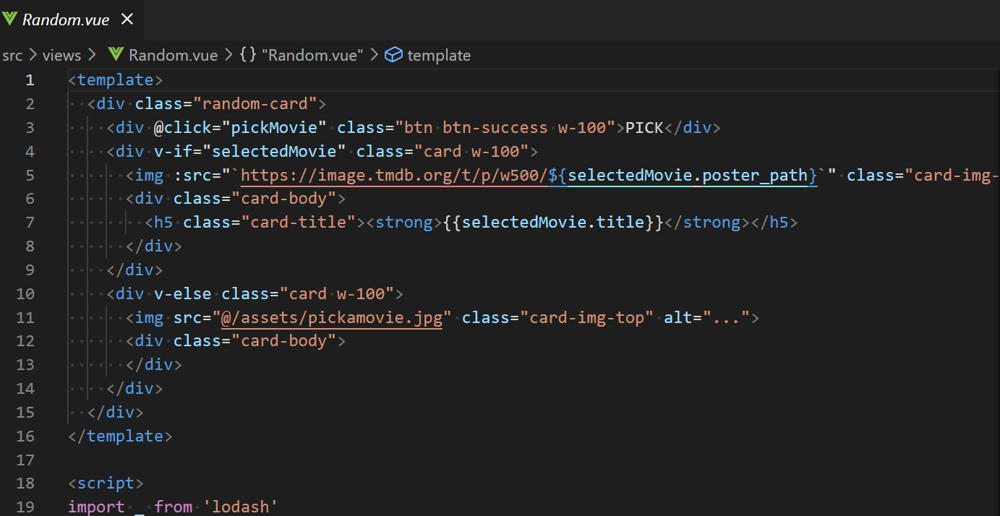
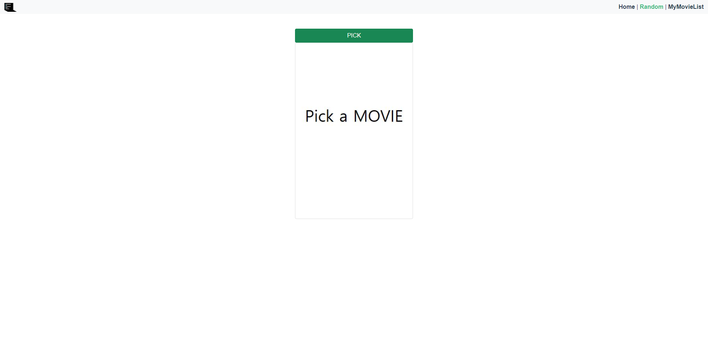
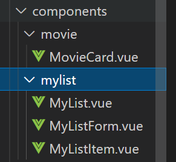
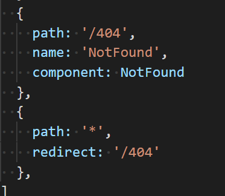
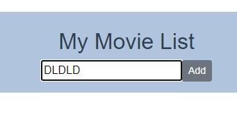
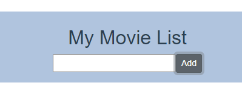
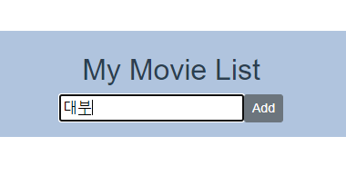
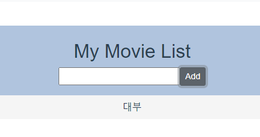

# PJT_10_박주윤SIDE

### Vue를 활용한 SPA 구성

### 목표

- 영화 정보를 제공하는 SPA 제작
- AJAX통신과 JSON 구조에 대한 이해
- Single File Component 구조에 대한 이해
- vue-cli, vuex, vue-router등 플러그인 활용

### 컴포넌트의 구조

##### 처음으로 네비게이터 역할을 땀흘리며 했다.

##### 드라이버의 스피디한 운전실력에 기함하며 쉴새없이 생각했다. 

##### 특히 이번 관통 프로젝트에서 강하게 느낀 점은 이 방대한 작업, 협업프로젝트가 재미있다는 점이었다.

##### 동유와 함께 하는 프로젝트를 언제고 기다렸었다. 이전부터 디스코드로 어떤 문제에 대한 논의를 할때는 항상 끝나지 않고 길어지는데 그 점이 가장 즐거웠다. 

##### 엉뚱함과 편의성 그리고 최적화를 위해 강제로 굴러가는 생각보따리는 여러가지 문제를 풀어낼 수 있었다. 

##### 물론 빠른 구현과 협업을 통해 더 발전적인 방향으로 나아갈 수 있었고, 특유의 고집스런 페어의 모습을 보며 즐거웠다. 

---

#### 문제의 인식 :

##### 1) random 창으로 바로 가게 되었을 때 home을 가주지 않으면 refresh 되지 않아 데이터값이 

##### null 인 상태로 들어가서 random 영화를 출력할 수 없었다. 

##### 그래서 home으로 옮겨갔다와야하는 번거로운 일이 생긴 이슈가 있었다.

##### 2) random.vue에서 이용하고자 하는 사진파일을 넣어주기 위해 images폴더를 프로젝트 폴더에 넣었다가 이미지 파일의 이름문제? 가 발생하여 폴더 자체를 삭제하였더니 발생한 오류가 dimension 오류가 발생하였는데 문제의 원인을 한참 찾지 못하다 새롭게 프로젝트를 만들어 진행하려함. 

### 해결 : 

##### 1) home.vue에 있는 created ()에서 번거롭게 이동하며 왔다갔다 해야지만 

##### 새롭게 refresh  되는 부분을 상위의 vue파일 app.vue파일에 옮김으로 

##### 간단히 작업을 최소화 할 수 있었습니다.

##### 2) assets폴더에 이름을 소문자로 새롭게 작성하여 넣어주고 출력하였더니 출력을 할 수 있었다.(아래의 Pick a MOVIE 사진)

---

### 새롭게 알게된 부분:

##### - components 에서 한개의 파일만 존재하는 상황만 만났었는데 여러가지 components들이 

##### 내부에 존재하게 되어 복잡성을 보일 것 같아 폴더를 분류하여 정리한 것이 어렵지 않게 적용되어 간결하게 표현이 가능하였음을 알게되었다.

##### - 페이지의 오류를 처음 router에서 잡아낼 수 있도록 하는데 redirect 와 path: '*'를 이용해 간단히 표현이 가능했다. 

##### - 마구 작성한 파일이름을 우선적으로 발견하고 차단조치를 취하는 알고리즘을 사용해 주었다. (IN은 .TITLE이 아닌 상황에서는 사용이 가능하다고 함!!)

> 입력하여 ADD 하여도 리스트에 PUSH 되지 않는 화면

> 존재하는 값을 확인하고 리스트에 PUSH 된 화면

> css를 오래간만에 이용해보아서 구현하고자 하는 모든 것들이 css로 가능하리라 생각이 된 부분이 오늘 오버타임까지 하면서 느낄 수 있었다.
>
> 다음번에는 overview와 같은 각기 다른 길이의 줄들을 height 속성을 통해 줄임표를 사용할 수 있는 css를 찾아 적용해 봐야겠다. 

#### 다음 주 전체 프로젝트가 무척이나 기대된다. 더 발전하도록 해야 겠다.

